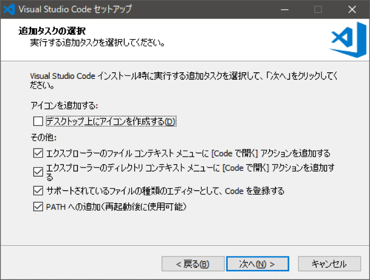

# VS CODE準備

## 目次
- [VS CODE準備](#vs-code%e6%ba%96%e5%82%99)
  - [目次](#%e7%9b%ae%e6%ac%a1)
  - [VS CODE　本体のインストール](#vs-code-%e6%9c%ac%e4%bd%93%e3%81%ae%e3%82%a4%e3%83%b3%e3%82%b9%e3%83%88%e3%83%bc%e3%83%ab)
  - [ダウンロード](#%e3%83%80%e3%82%a6%e3%83%b3%e3%83%ad%e3%83%bc%e3%83%89)
  - [インストール](#%e3%82%a4%e3%83%b3%e3%82%b9%e3%83%88%e3%83%bc%e3%83%ab)
    - [「次へ」ボタンをクリック](#%e6%ac%a1%e3%81%b8%e3%83%9c%e3%82%bf%e3%83%b3%e3%82%92%e3%82%af%e3%83%aa%e3%83%83%e3%82%af)
    - [「同意する」を選択し、「次へ」ボタンをクリック](#%e5%90%8c%e6%84%8f%e3%81%99%e3%82%8b%e3%82%92%e9%81%b8%e6%8a%9e%e3%81%97%e6%ac%a1%e3%81%b8%e3%83%9c%e3%82%bf%e3%83%b3%e3%82%92%e3%82%af%e3%83%aa%e3%83%83%e3%82%af)
    - [必要に応じてインストールディレクトリを選択し、「次へ」ボタンをクリック](#%e5%bf%85%e8%a6%81%e3%81%ab%e5%bf%9c%e3%81%98%e3%81%a6%e3%82%a4%e3%83%b3%e3%82%b9%e3%83%88%e3%83%bc%e3%83%ab%e3%83%87%e3%82%a3%e3%83%ac%e3%82%af%e3%83%88%e3%83%aa%e3%82%92%e9%81%b8%e6%8a%9e%e3%81%97%e6%ac%a1%e3%81%b8%e3%83%9c%e3%82%bf%e3%83%b3%e3%82%92%e3%82%af%e3%83%aa%e3%83%83%e3%82%af)
    - [「次へ」ボタンをクリック](#%e6%ac%a1%e3%81%b8%e3%83%9c%e3%82%bf%e3%83%b3%e3%82%92%e3%82%af%e3%83%aa%e3%83%83%e3%82%af-1)
    - [オプション確認して「次へ」ボタンをクリック](#%e3%82%aa%e3%83%97%e3%82%b7%e3%83%a7%e3%83%b3%e7%a2%ba%e8%aa%8d%e3%81%97%e3%81%a6%e6%ac%a1%e3%81%b8%e3%83%9c%e3%82%bf%e3%83%b3%e3%82%92%e3%82%af%e3%83%aa%e3%83%83%e3%82%af)
    - [「インストール」ボタンをクリックするとインストールが始まります。](#%e3%82%a4%e3%83%b3%e3%82%b9%e3%83%88%e3%83%bc%e3%83%ab%e3%83%9c%e3%82%bf%e3%83%b3%e3%82%92%e3%82%af%e3%83%aa%e3%83%83%e3%82%af%e3%81%99%e3%82%8b%e3%81%a8%e3%82%a4%e3%83%b3%e3%82%b9%e3%83%88%e3%83%bc%e3%83%ab%e3%81%8c%e5%a7%8b%e3%81%be%e3%82%8a%e3%81%be%e3%81%99)
    - [インストールが完了しました](#%e3%82%a4%e3%83%b3%e3%82%b9%e3%83%88%e3%83%bc%e3%83%ab%e3%81%8c%e5%ae%8c%e4%ba%86%e3%81%97%e3%81%be%e3%81%97%e3%81%9f)
    - [「完了」ボタンをクリックし終了します。](#%e5%ae%8c%e4%ba%86%e3%83%9c%e3%82%bf%e3%83%b3%e3%82%92%e3%82%af%e3%83%aa%e3%83%83%e3%82%af%e3%81%97%e7%b5%82%e4%ba%86%e3%81%97%e3%81%be%e3%81%99)
  

## VS CODE　本体のインストール

## ダウンロード
下記URLからVSCODEをダウンロードします。

(ダウンロード済みのバージョンは　50_ETC\soft\VSCodeUserSetup-x64-1.45.1.exe)に置いています。

https://azure.microsoft.com/ja-jp/products/visual-studio-code/

**今すぐダウンロード**　をクリックします。

**Windows**　をクリックします。

ダウンロードフォルダに　VSCodeUserSetup*.*.\*.exe が保存されます。

----

## インストール

VSCodeUserSetup*.*.\*.exe　のセットアップファイルを起動

### 「次へ」ボタンをクリック

### 「同意する」を選択し、「次へ」ボタンをクリック

### 必要に応じてインストールディレクトリを選択し、「次へ」ボタンをクリック

### 「次へ」ボタンをクリック

### オプション確認して「次へ」ボタンをクリック

### 「インストール」ボタンをクリックするとインストールが始まります。

### インストールが完了しました

### 「完了」ボタンをクリックし終了します。
