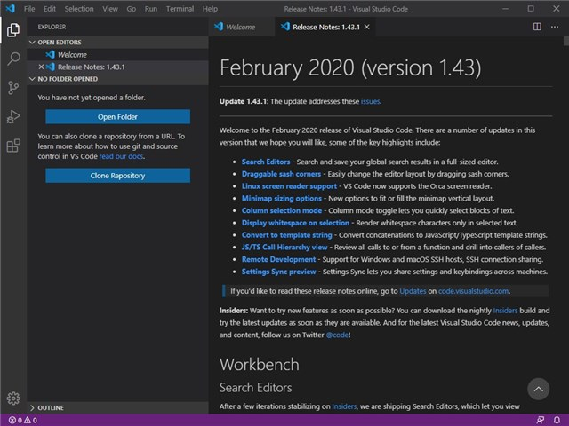
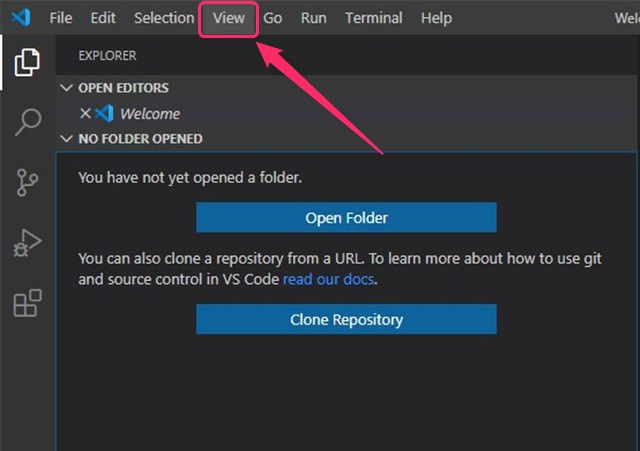
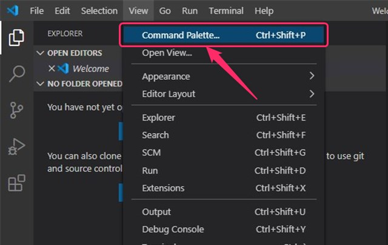
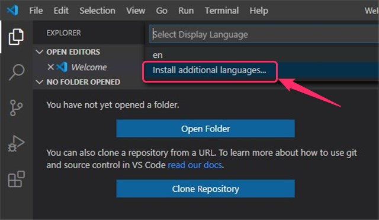
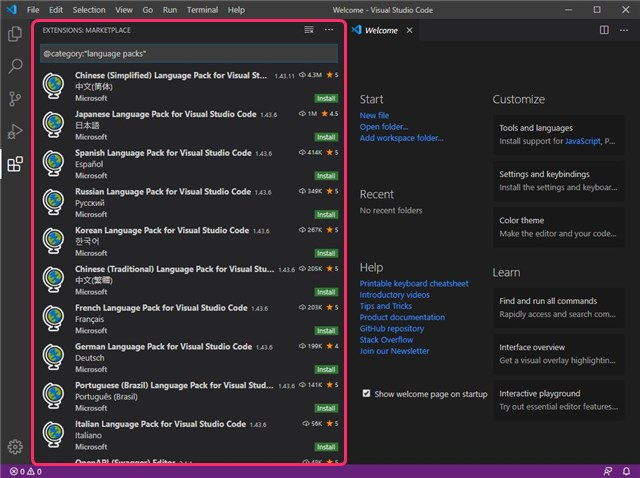
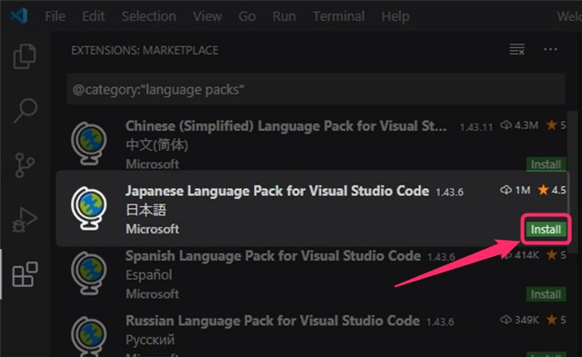
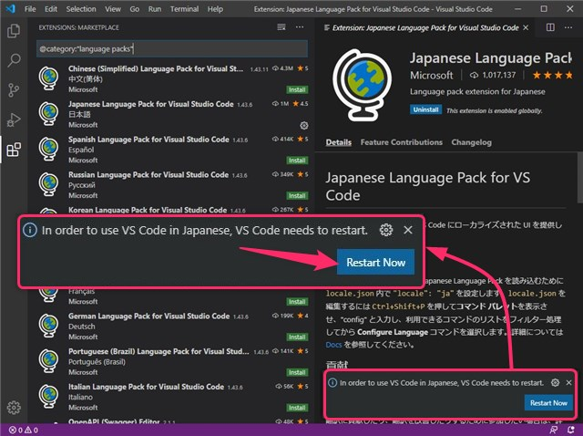
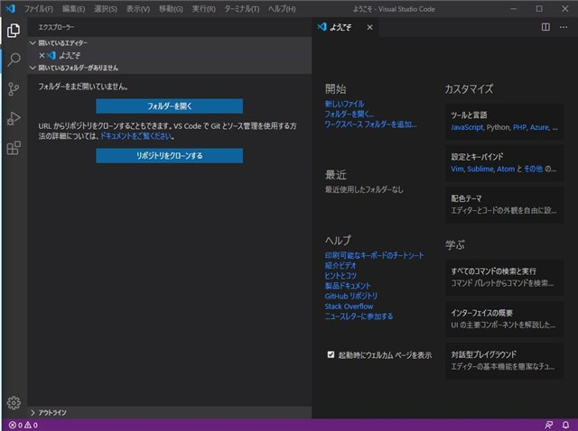

# VS CODE日本語化

## 概要
- [VS CODE日本語化](#vs-code日本語化)
  - [概要](#概要)
  - [VSCODEを起動](#vscodeを起動)
  - [View を選択](#view-を選択)
  - [Command Palette… を選択](#command-palette-を選択)
  - [Configure Display Language を選択](#configure-display-language-を選択)
  - [Install additional languages… を選択](#install-additional-languages-を選択)
  - [Japanese Language Pack をインストール](#japanese-language-pack-をインストール)
  - [Visual Studio Code の再起動](#visual-studio-code-の再起動)
  - [Visual Studio Code の日本語化が完了](#visual-studio-code-の日本語化が完了)

----
## VSCODEを起動

## View を選択
画面上部の **「View」** をクリックします。

## Command Palette… を選択
**「Vew」** のクリック後に選択リストが表示されます。

一覧から **「Command Palette…」** をクリックします。

## Configure Display Language を選択
選択リストの表示一覧から **「Configure Display Language」** をクリックします。

## Install additional languages… を選択
選択リストの表示から **「Install additional languages…」** をクリックします。

## Japanese Language Pack をインストール　
画面左側に **「拡張言語パック」** の一覧が表示されます。

一覧の中から
**「Japanese Language Pack for Visual Studio Code 日本語 Microsoft」** (下図)
を探します。

**「Japanese Language Pack for Visual Studio Code」** を探して右下の **「Install」** をクリックします。

## Visual Studio Code の再起動
インストールが完了すると画面右下に再起動を促す表示がでますので **「Restart Now」** をクリックします。

## Visual Studio Code の日本語化が完了
自動でVSCode の再起動処理が行われ、**日本語表示** で起動しました。

