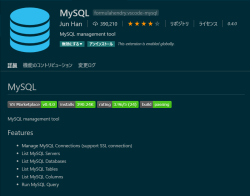

# 機能拡張追加

## 目次
- [機能拡張追加](#機能拡張追加)
  - [目次](#目次)
  - [フロントエンド](#フロントエンド)
    - [Prettier: code formatter(任意)](#prettier-code-formatter任意)
  - [バックエンド](#バックエンド)
    - [Java Extention Pack(必須)](#java-extention-pack必須)
    - [Spring Boot Extention Pack(必須)](#spring-boot-extention-pack必須)
    - [Lombok Annotation Support(必須)](#lombok-annotation-support必須)
  - [DB TOOLS](#db-tools)
    - [MySQL(任意)](#mysql任意)
  - [Docker](#docker)
    - [Docker(必須)](#docker必須)

----
## フロントエンド
### Prettier: code formatter(任意)
コードフォーマッタ。各種コードの構文に対応。必須ではないが、非常に有用。

## バックエンド
### Java Extention Pack(必須)

### Spring Boot Extention Pack(必須)

### Lombok Annotation Support(必須)

## DB TOOLS
### MySQL(任意)
VS CODEからSQLを実行できる。検索結果も表形式で表示可能。

## Docker
### Docker(必須)
コマンドラインからも操作できるが、GUIで操作できるのでわかりやすい。

