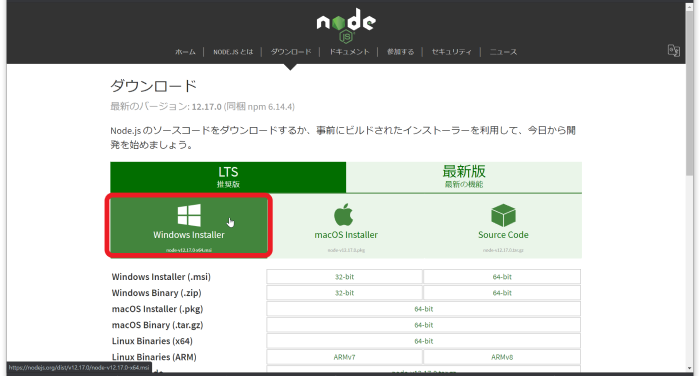
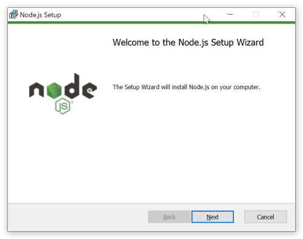
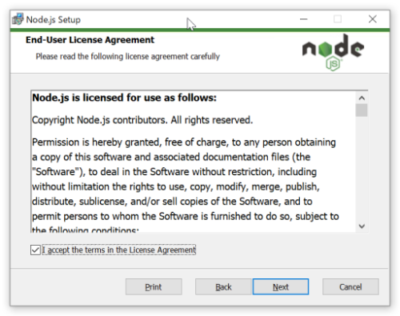
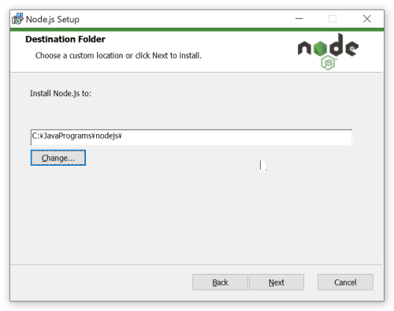
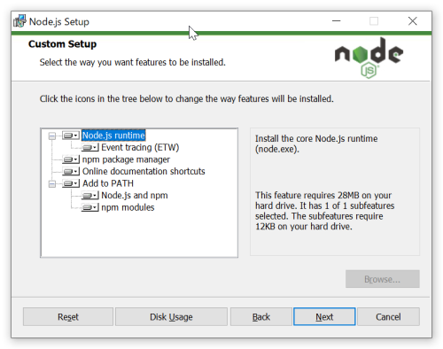
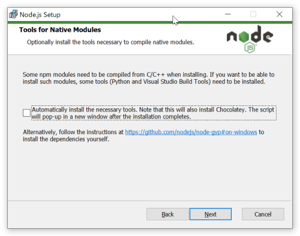
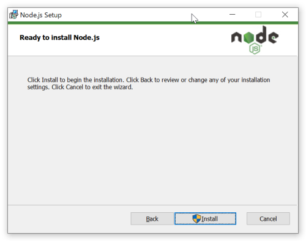
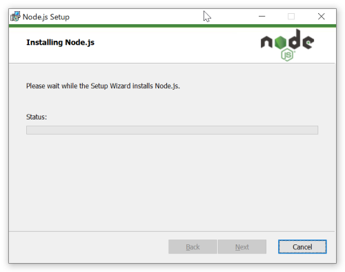
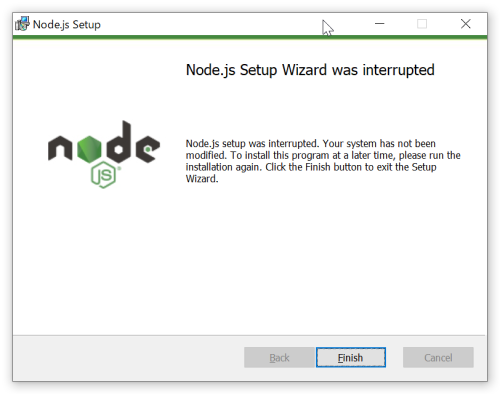

# Node.jsインストール

## 概要
- [Node.jsインストール](#nodejsインストール)
  - [概要](#概要)
  - [Node.jsダウンロード](#nodejsダウンロード)
  - [Node.jsをインストールする](#nodejsをインストールする)
    - [インストーラを起動](#インストーラを起動)
    - [ライセンス同意](#ライセンス同意)
    - [インストールフォルダ指定](#インストールフォルダ指定)
    - [モジュール選択](#モジュール選択)
    - [オプション追加指定](#オプション追加指定)
    - [インストール指示](#インストール指示)
    - [インストール完了](#インストール完了)
  - [インストール完了を確認する](#インストール完了を確認する)
- [yarnをインストールする](#yarnをインストールする)

## Node.jsダウンロード
Node.jsのHP（以下のURL）よりインストーラーをダウンロードする。

ダウンロード済みファイル：　50_ETC\soft\node-v12.17.0-x64.msi

```
https://nodejs.org/ja/download/
```




## Node.jsをインストールする
### インストーラを起動
インストーラを起動し、**「Next」** ボタンをクリックします。



### ライセンス同意
ライセンス同意にチェックを入れ、**「Next」** ボタンをクリックします。



### インストールフォルダ指定
インストールするフォルダを指定し、**「Next」** ボタンをクリックします。



### モジュール選択
インストールするモジュールを選択し、**「Next」** ボタンをクリックします。

デフォルトのままで良いでしょう。



### オプション追加指定
Nativeモジュール追加は、今は必要ないのでチェックせずに、**「Next」** ボタンをクリックします。



### インストール指示
**「Install」** ボタンをクリックし、インストール開始します。





### インストール完了
インストールが完了しました。**「Finish」** ボタンをクリックして終了します。




## インストール完了を確認する

CMDを起動し、下記コマンドでインストール完了を確認する

```
CMD> node --version
v12.16.1

CMD>
```
---
# yarnをインストールする

引き続きコマンドラインで以下のコマンドを実行し、yarnをインストールします。

```
CMD> npm i -g yarn
C:\Users\katouhis\AppData\Roaming\npm\yarn -> C:\Users\katouhis\AppData\Roaming\npm\node_modules\yarn\bin\yarn.js
C:\Users\katouhis\AppData\Roaming\npm\yarnpkg -> C:\Users\katouhis\AppData\Roaming\npm\node_modules\yarn\bin\yarn.js
+ yarn@1.22.4
:

CMD>
```

