# MariaDB(MySQL互換DB)インストール

## 概要
- [MariaDB(MySQL互換DB)インストール](#mariadbmysql互換dbインストール)
  - [概要](#概要)
  - [ダウンロード](#ダウンロード)
  - [インストール](#インストール)
  - [動作確認](#動作確認)
    - [サービス起動状況の確認](#サービス起動状況の確認)
    - [DB情報を確認](#db情報を確認)
  - [sampledbデータベース・sampleユーザー作成](#sampledbデータベースsampleユーザー作成)
    - [sampledbデータベース作成](#sampledbデータベース作成)
    - [sampleユーザー作成](#sampleユーザー作成)
    - [サンプルテーブル作成](#サンプルテーブル作成)
  - [サービス起動設定変更](#サービス起動設定変更)

---
## ダウンロード
下記URLよりMariaDBをダウンロードする。

本家MySQLはOracleのアカウント登録が必要でオプションも豊富なため、今回の「必要最小限のDB」という目的には合わないため互換DBでインストール・設定が比較的容易なMariaDBをインストールする。

ダウンロード済ファイル：50_ETC\soft\mariadb-10.4.13-winx64.msi

```
https://mariadb.org/
```

**「Dwonload」** ボタンをクリックする

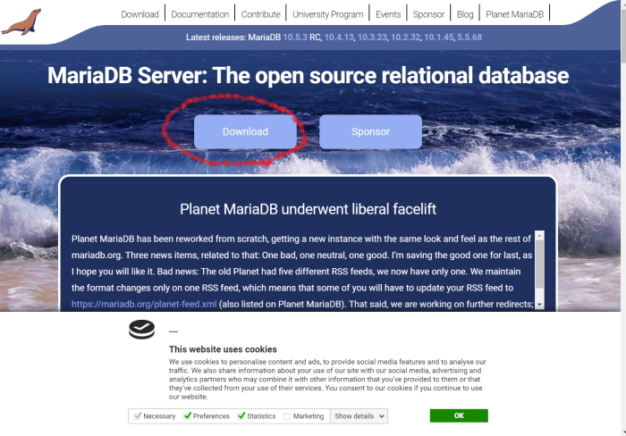

**「Download MariaDB Server」** をクリックする

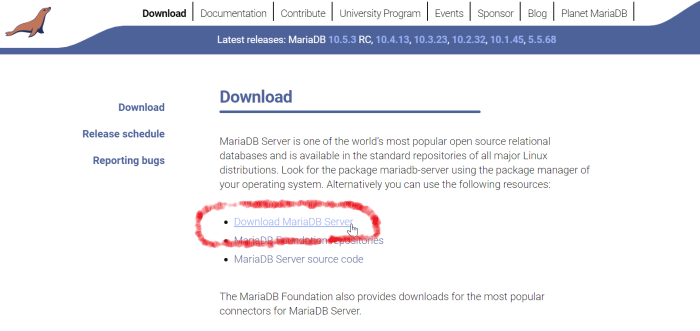

**「Download 10.4.13 Stable Now!」** をクリックする

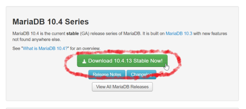

**「Windows x86_64 MSI package」** を選択する

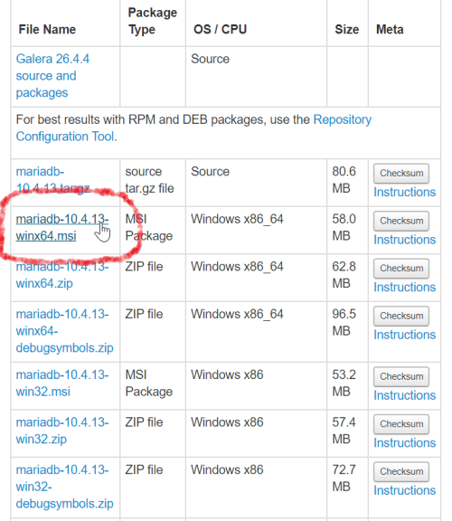

## インストール

mariadb-10.4.13-winx64.msi をダブルクリックしてインストーラーを起動し、<br/>
**「Next」** ボタンをクリックします。

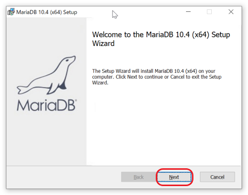

ライセンス同意をチェックして **「Next」** ボタンをクリックします。

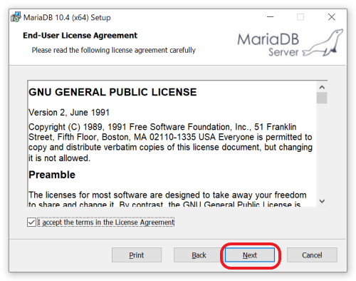

インストールモジュールを選択して、**「Next」** ボタンをクリックします。<br/>
最小構成とするために、Backup utilities, Development Componets, Third party tools はインストールしません。

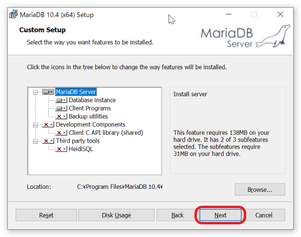

**「Modify password for database user 'root'」** のチェックを外し、<br/>
**「Use UTF8 as default server's character set」** にチェックを入れて、<br/>
**「Next」** ボタンをクリックします。

rootにパスワード設定をしたい場合は、Modify...にチェックを入れてパスワード設定します。

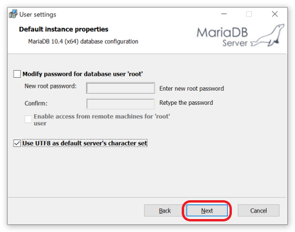

**「Buffer pool size」** を500MBに変更して、あとはデフォルトのままとし、<br/>
**「Next」** ボタンをクリックします。

他に **3306番** ポートを利用するサービスがある場合はポート番号を変更します。

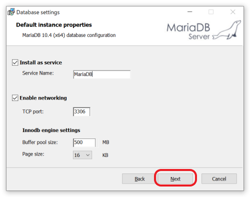

**「Next」** ボタンをクリックします。

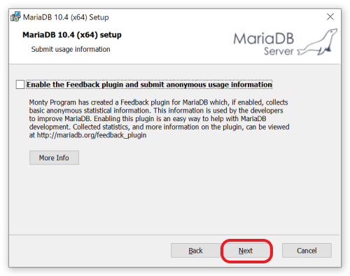

**「Install」** ボタンをクリックします。

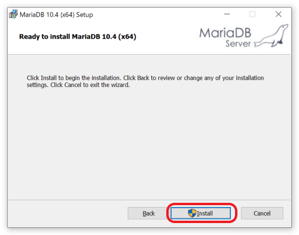

管理者として実行することを確認する画面になるので、「はい」を選びます。

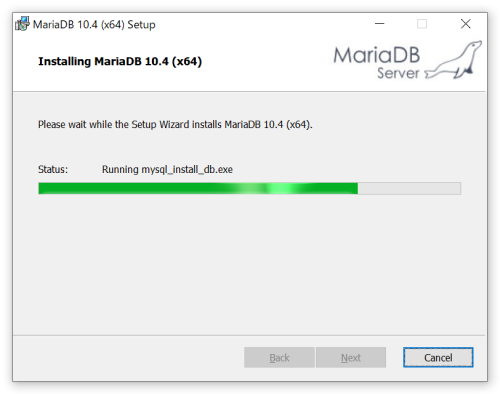

最後に **「Finish」** ボタンをクリックして終了します。

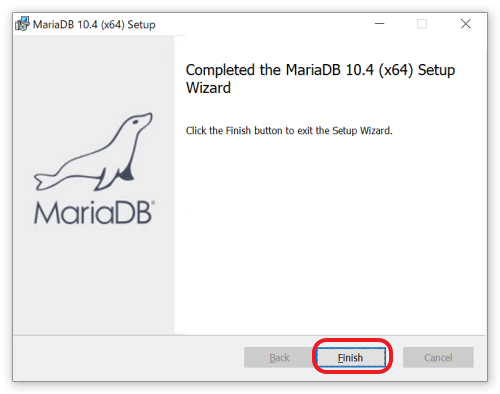


## 動作確認

### サービス起動状況の確認
コマンドプロンプトから **scコマンド** でサービス起動状況を確認します。

**「コントロールパネル」** の **「サービス」** から確認しも良いです。

```
CMD> sc query MariaDB

SERVICE_NAME: MariaDB
        TYPE               : 10  WIN32_OWN_PROCESS
        STATE              : 4  RUNNING
                                (STOPPABLE, PAUSABLE, ACCEPTS_SHUTDOWN)
        WIN32_EXIT_CODE    : 0  (0x0)
        SERVICE_EXIT_CODE  : 0  (0x0)
        CHECKPOINT         : 0x0
        WAIT_HINT          : 0x0
```

### DB情報を確認
**databases** コマンドでDB情報を確認します。

コマンドプロンプトから **mysqlクライアント** を起動して確認します。


```
CMD> "C:\Program Files\MariaDB 10.4\bin\mysql.exe" -uroot -p
Enter password:
Welcome to the MariaDB monitor.  Commands end with ; or \g.
Your MariaDB connection id is 9
Server version: 10.4.13-MariaDB mariadb.org binary distribution

Copyright (c) 2000, 2018, Oracle, MariaDB Corporation Ab and others.

Type 'help;' or '\h' for help. Type '\c' to clear the current input statement.

MariaDB [(none)]> show databases;
+--------------------+
| Database           |
+--------------------+
| information_schema |
| mysql              |
| performance_schema |
| test               |
+--------------------+
4 rows in set (0.004 sec)
```

## sampledbデータベース・sampleユーザー作成
そのままSQLコマンドラインにて、下記を実行する。

### sampledbデータベース作成

```
MariaDB [(none)]> create database sampledb character set utf8;
Query OK, 1 row affected (0.002 sec)
```

### sampleユーザー作成

```
MariaDB [(none)]> grant all on sampledb.* to 'sample'@'localhost' identified by 'sample';
Query OK, 0 rows affected (0.135 sec)

MariaDB [(none)]> flush privileges;
Query OK, 0 rows affected (0.126 sec)

MariaDB [(none)]> quit
Bye
```

### サンプルテーブル作成
sampleユーザーでmysqlを起動する

```
CMD> "C:\Program Files\MariaDB 10.4\bin\mysql.exe" -usample -psample sampledb
Welcome to the MariaDB monitor.  Commands end with ; or \g.
Your MariaDB connection id is 9
Server version: 10.4.13-MariaDB mariadb.org binary distribution

Copyright (c) 2000, 2018, Oracle, MariaDB Corporation Ab and others.

Type 'help;' or '\h' for help. Type '\c' to clear the current input statement.

MariaDB [sampledb]>
```
table作成と初期データ登録

```
MariaDB [sampledb]> source 10_create_tableSJ.sql
Query OK, 0 rows affected (0.776 sec)

Query OK, 7 rows affected (0.070 sec)
Records: 7  Duplicates: 0  Warnings: 0
```
登録データの確認

```
MariaDB [sampledb]> select id,title from items;
+----+------------------------------------------+
| id | title                                    |
+----+------------------------------------------+
|  1 | WEB Application作成                      |
|  2 | RESTful API作成                          |
|  3 | フロントエンドとバックエンドを結合       |
|  4 | MySQLのDockerイメージを作成する          |
|  5 | バックエンドのDockerイメージを作成する   |
|  6 | フロントエンドのDockerイメージを作成する |
|  7 | Docker-composeでパッケージ化する         |
+----+------------------------------------------+
7 rows in set (0.001 sec)

MariaDB [sampledb]> quit
Bye

```

## サービス起動設定変更
初期状態ではサービス自動起動となっているため、必要時に手動起動するように起動方法を変更する。

スタート＞Windows管理ツール＞サービスを選択する。

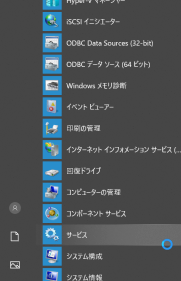

MariaDBをダブルクリックで開く

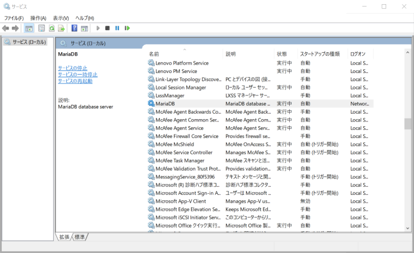

**「スタートアップの種類」** を **「自動」** から **「手動」** に変更する

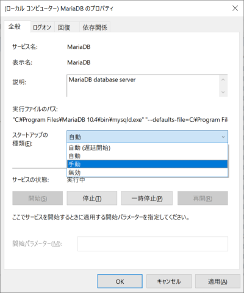

