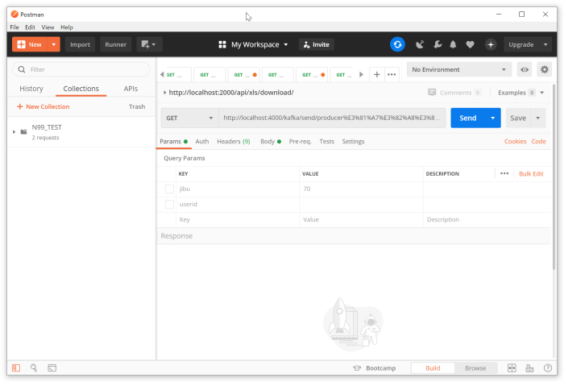

# POSTMANインストール

RESTful APIの動作確認を行うツール、POSTMANをインストールする。

## 概要
- [POSTMANインストール](#postmanインストール)
  - [概要](#概要)
  - [ダウンロード](#ダウンロード)
  - [インストール](#インストール)
  - [動作確認](#動作確認)

---
## ダウンロード
Postman（ https://www.postman.com/downloads/ ）よりダウンロードする。

ダウンロード済みファイル：50_ETC\soft\Postman-win64-7.25.0-Setup.exe

Windows 64bitを選択してダウンロードする。

## インストール

Postman-win64-7.25.0-Setup.exe　をダブルクリックすると、スプラッシュ画面となり、 
しばらくするとインストールが完了し、アプリケーション画面が開く。

## 動作確認
下記URLをGETとして登録し **「Send」** ボタンをクリックすると結果が表示される。

http://weather.livedoor.com/forecast/webservice/json/v1?city=270000

