# Docker インストール

## 概要
- [Docker インストール](#docker-インストール)
  - [概要](#概要)
  - [システム要件](#システム要件)
  - [ダウンロード](#ダウンロード)
    - [公式サイトからダウンロード](#公式サイトからダウンロード)
  - [環境確認](#環境確認)
    - [BIOSレベルで仮想化設定されているか確認](#biosレベルで仮想化設定されているか確認)
  - [環境設定](#環境設定)
    - [BIOS設定](#bios設定)
    - [Hyper-Vとcontainerの有効化](#hyper-vとcontainerの有効化)
  - [インストール](#インストール)
  - [起動確認](#起動確認)

---
## システム要件
下記要件を満たしていることが前提となります。

- Windows 10 64-bit: Pro, Enterprise, 又は Education (Build 15063 以降)
- SLAT対応64-bitのプロセッサーが必要
- 4GB以上のメモリ
- Hyper-V と Containers を有効化する必要がある
- BIOSレベルでVirtualization を有効化する必要がある

## ダウンロード
### 公式サイトからダウンロード
公式サイト　↓　からインストーラをダウンロードします。 
https://hub.docker.com/editions/community/docker-ce-desktop-windows/

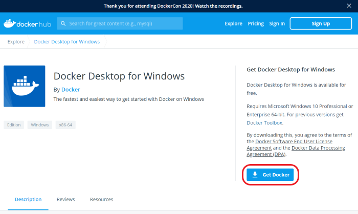

ダウンロード済みファイル：50_ETC\soft\Docker Desktop Installer.exe

## 環境確認
### BIOSレベルで仮想化設定されているか確認
タスクマネージャ＞パフォーマンス　のタブを開き、右下部分の **「仮想化」** が有効になっているか確認します。 
有効になっていない場合は、[BIOSの設定](#bios設定)が必要です。 
有効になっている場合は、[Hyper-Vとcontainerの有効化](#hyper-vとcontainerの有効化) に進んでください。

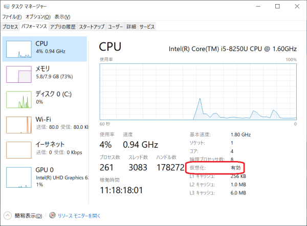

## 環境設定
Dockerを利用する環境を設定します。

### BIOS設定
Windowsを再起動し、再起動中にPCのメーカーのロゴが表示されるかと思いますが、それが表示されている間にBIOS画面に入ります。メーカーによって入り方は異なりますが、「F1」、「F2」、「Del」などのキーを押すことでBIOS画面に入れますが、入れない場合は「メーカー名 bios　入り方」などで調べてみてください。

BIOS画面はメーカーによって異なりますが、Virtualizationのメニューを探します。

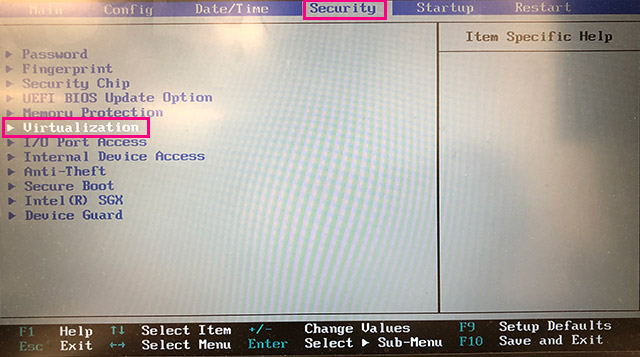

Intel Virtualization Technologyを「Enabled」に変更して「F10」で保存します。

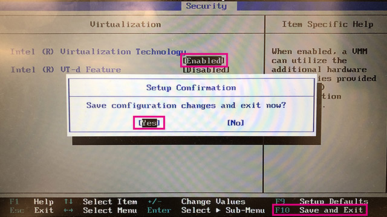

### Hyper-Vとcontainerの有効化
Hyper-VとContainerの有効化を行います。

Windowsメニューから **「設定」** を開いて、 **「アプリ」** を選択します。 
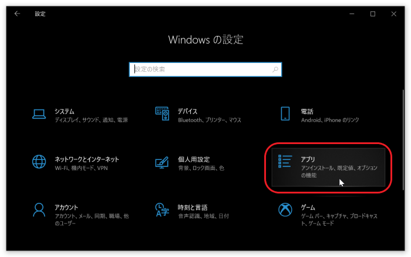

下にスクロールして **「関連設定＞プログラムと編集」** を選択します。 
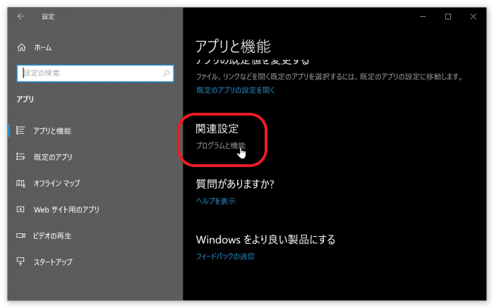

**「Windowsの機能の有効化または無効化」** を選択します。 
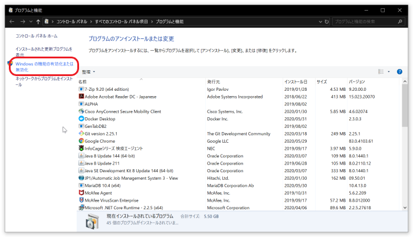

この画面が表示されるので **「Hyper-V」** と **「Container」** にチェックを入れて「OK」をクリックします。 
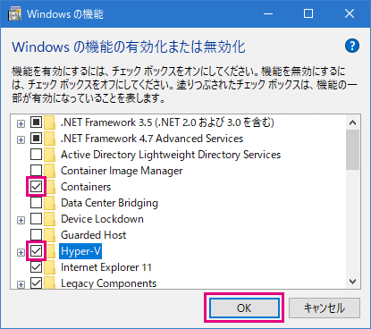

## インストール

Docker Desktop Installer.exe をダブルクリックするとインストールが始まります。 
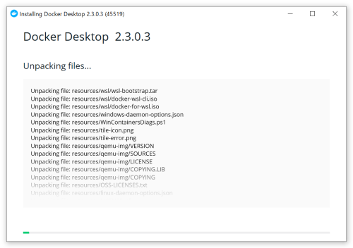

**「Close」** ボタンをクリックしてインストールを完了します。 
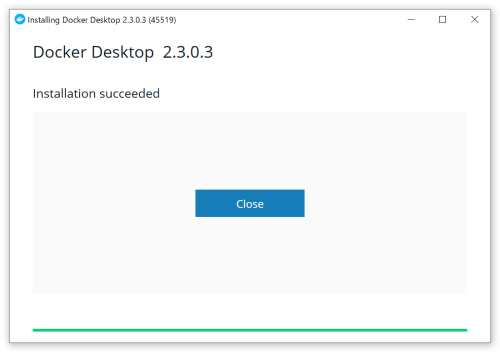

## 起動確認

デスクトップに作成された **「Docker Desktop」** アイコンを選択し、右ボタン押下で **「管理者として実行」** を選択します。

インジケーターにアイコンが表示され、アニメーションが終われば起動完了です。 

アイコンを右クリックしメニュー表示し **「Setting」** を選択し設定画面を開きます。 
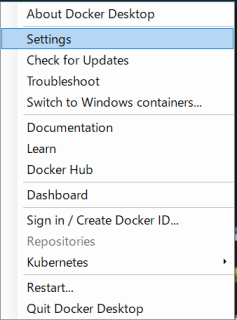

Dockerはメモリを大量に消費するので、普段は起動しないように **「Start ...」** のチェックは外しておきます。 
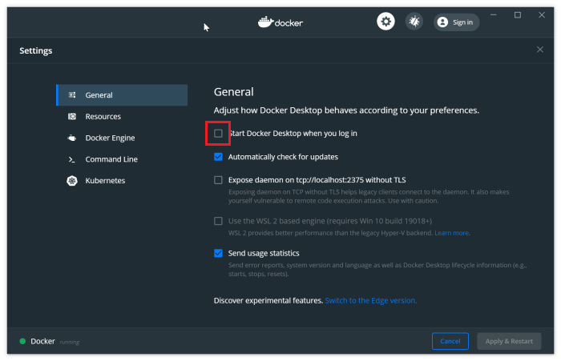

